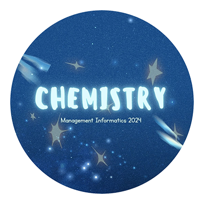

  
  <h1 align="center">ICMSTRY - IC 2024</h1>
  

    Website resmi untuk kelas <strong>Manajemen Informatika 1-IC (2024)</strong> di <strong>Politeknik Negeri Sriwijaya</strong>.
     
    <a href="#-fitur-unggulan"><strong>Jelajahi Fitur »</strong></a>
  

  
  
  
  
  

---

## 🚀 Tentang Website Ini

**ICMSTRY** adalah sebuah portal digital yang didedikasikan untuk kelas 1-IC Manajemen Informatika di Politeknik Negeri Sriwijaya. Website ini berfungsi sebagai pusat informasi, galeri kenangan, dan platform interaktif bagi seluruh anggota kelas.

## ✨ Fitur Unggulan

- **🗓️ Jadwal Perkuliahan**: Tampilan jadwal mata kuliah yang terorganisir per hari.
- **🧑‍🤝‍🧑 Struktur & Anggota Kelas**: Menampilkan daftar perangkat kelas dan seluruh anggota kelas dengan foto dan posisi.
- **🖼️ Galeri Kegiatan**: Kumpulan momen-momen tak terlupakan yang telah dilalui bersama, ditampilkan dalam galeri yang responsif.
- **📂 Proyek Kelas**: Showcase untuk proyek-proyek inovatif yang telah dan akan dikerjakan oleh kelas.
- **🤫 Papan Pesan Anonim**: Sebuah platform bagi siapa saja untuk mengirimkan pesan rahasia kepada anggota kelas.
- **🤖 Moderasi Konten AI**: Setiap pesan anonim yang dikirim akan diperiksa secara otomatis oleh AI untuk menyaring konten yang tidak pantas, memastikan lingkungan yang aman dan positif.
- **🔐 Dashboard Admin**: Halaman khusus yang dilindungi kata sandi bagi admin untuk memoderasi dan menghapus pesan yang masuk.

## 🛠️ Teknologi yang Digunakan

- **Frontend**: Dibangun dengan **Next.js** dan **React**, dihias dengan **Tailwind CSS** dan komponen dari **ShadCN/UI**.
- **Backend & Database**: Mengandalkan **Firebase** untuk otentikasi (Anonymous Auth) dan **Cloud Firestore** sebagai database NoSQL real-time.
- **Platform Pengembangan**: Dirancang dan dibuat menggunakan **Firebase Studio**, sebuah lingkungan pengembangan berbasis AI.

---

  
<strong>Developed by:</strong> Dimas Yuda Pratama

  
<strong>AI Controlled By:</strong> Gemini 2.5 Flash

  
<strong>Created Using:</strong> Firebase Studio

